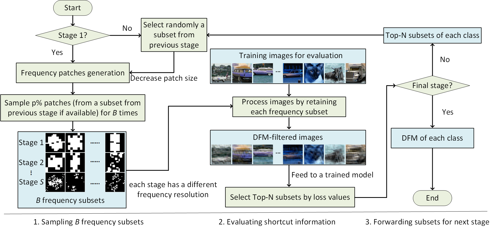

## Official website of 'Do ImageNet-trained models learn shortcuts? The impact of frequency shortcuts on generalization (Paper accepted at CVPR2025)'
#### The paper is available on [arXiv](https://arxiv.org/abs/2503.03519).

### Introduction

Frequency shortcuts refer to specific frequency patterns that models heavily rely on for correct classification. Previous studies have shown that models trained on small image datasets often exploit such shortcuts, potentially impairing their generalization performance. However, existing methods for identifying frequency shortcuts require expensive computations and become impractical for analyzing models trained on large datasets. In this work, we propose the first approach to more efficiently analyze frequency shortcuts at a larger scale. We show that both CNN and transformer models learn frequency shortcuts on ImageNet. We also expose that frequency shortcut solutions can yield good performance on out-of-distribution (OOD) test sets which largely retain texture information. However, these shortcuts, mostly aligned with texture patterns, hinder model generalization on rendition-based OOD test sets. These observations suggest that current OOD evaluations often overlook the impact of frequency shortcuts on model generalization. Future benchmarks could thus benefit from explicitly assessing and accounting for these shortcuts to build models that generalize across a broader range of OOD scenarios. 

<p align="center"></p>


### Quick start

* Clone this repository:
```
git clone https://github.com/nis-research/hfss.git
cd hfss
```

* Installation
	* Python 3.9.12, cuda-11.7
		* You can create a virtual environment with conda and activate the environment before the next step
			```
			conda create -n virtualenv  python=3.9 anaconda
			source activate virtualenv
			conda install pytorch torchvision torchaudio pytorch-cuda=11.7 -c pytorch -c nvidia
			```
   

* Apply HFSS to find frequency shortcuts (an example of testing resnet18, stage 1-2)
```
python  hfss/search.py --dataset imagenet1k  --maskname saved_DFMs_stage1  --stage stage1 
python  hfss/search.py --dataset imagenet1k  --maskname saved_DFMs_stage2  --stage stage2  --mask_path DFM/saved_DFMs_stage1 
```

* Configuration to be adjusted when running search.py:
```
--N_B [specify the number of sampled shortcut candidates]
--P [proportion of frequency patches]
--batch_size [the number of images per batch to be evaluated]
--seed [random seed]
--model_path [pretrained model weights from timm, you can customize your own model]
```


* Evaluating the degree of shortcut learning with DFMs
  
Step 1: download test datasets: [ImageNet-1k](https://image-net.org/download.php), [ImageNet-v2](https://github.com/modestyachts/ImageNetV2), [ImageNet-C](https://zenodo.org/records/2235448), [ImageNet-Sketch](https://github.com/HaohanWang/ImageNet-Sketch), [ImageNet-R](https://github.com/hendrycks/imagenet-r).

Step 2: obtain class-wise TPR on ImageNet-1k and OOD images, and their DFM-filtered images 	
```
python -u hfss/eval_in2cs.py --dataset ImageNet_C --stage s6    --m_path ./DFM/saved_DFMs_stage6    --corruption brightness  # Obtaining test results on IN-v2,-C and -S.

python -u hfss/eval_inr.py   --stage s6  --m_path ./DFM/saved_DFMs_stage6  --corruption INr

python -u hfss/eval_fgsm.py --stage s6 --m_path ./DFM/saved_DFMs_stage6   

```

* Processing test results and visualizing the degree of shortcut learning using [notebook](hfss/result_visual.ipynb) 


## Citation

```
@misc{wang2025imagenettrainedmodelslearnshortcuts,
      title={Do ImageNet-trained models learn shortcuts? The impact of frequency shortcuts on generalization}, 
      author={Shunxin Wang and Raymond Veldhuis and Nicola Strisciuglio},
      year={2025},
      eprint={2503.03519},
      archivePrefix={arXiv},
      primaryClass={cs.CV},
      url={https://arxiv.org/abs/2503.03519}, 
}
```

